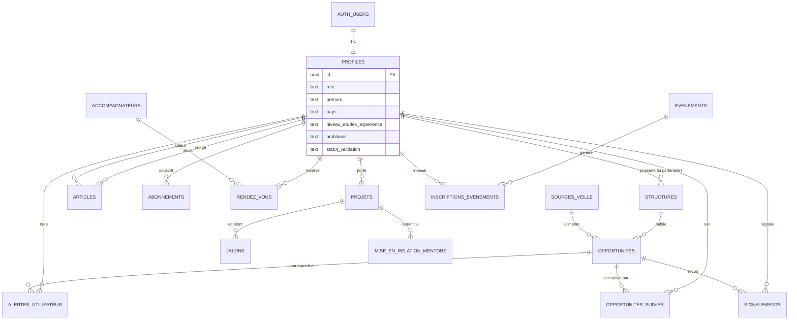

# Cahier des charges d'exécution — Plateforme YouthLinkIA

*Document destiné à l'exécution par agent de développement IA (Antigravity) — Vibe coding*
*Version 1.0 — Rédigé à partir de : Présentation institutionnelle, Charte éditoriale, Briefing fonctionnel, Identité visuelle*

---

## Sommaire

- [0. Préambule — Mode d'emploi de ce document avec Antigravity](#0-preambule)
- [1. Synthèse exécutive & objectifs de la plateforme](#1-synthese)
- [2. Arborescence du site & parcours utilisateurs par profil](#2-arborescence)
- [3. Spécifications fonctionnelles détaillées, module par module](#3-modules)
  - [3.0 Module 0 — Vitrine & moteur de contenu éditorial](#3-0-module0)
  - [3.1 Module 1 — Espace utilisateur & profil](#3-1-module1)
  - [3.2 Module 2 — Annuaire des structures et acteurs](#3-2-module2)
  - [3.3 Module 3 — Agent IA de veille & recherche d'opportunités](#3-3-module3)
  - [3.4 Module 4 — Orientation scolaire](#3-4-module4)
  - [3.5 Module 5 — Insertion professionnelle](#3-5-module5)
  - [3.6 Module 6 — Orientation entrepreneuriale](#3-6-module6)
  - [3.7 Module 7 — Pôle Tremplin de Carrière](#3-7-module7)
  - [3.8 Module 8 — Pôle Labo du Business](#3-8-module8)
  - [3.9 Module 9 — TalentUp Room (communauté)](#3-9-module9)
  - [3.10 Module 10 — Paiements, adhésions & abonnements B2B/B2G](#3-10-module10)
- [4. Modèle de données](#4-donnees)
- [5. Spécifications d'implémentation par brique technique](#5-implementation)
- [6. Design system synthétique](#6-design)
- [7. Exigences non-fonctionnelles](#7-nfr)
- [8. Plan de développement par phases (MVP → V2 → V3)](#8-phases)
- [9. Hypothèses retenues & points à valider avec le porteur de projet](#9-hypotheses)

---

<a id="0-preambule"></a>
## 0. Préambule — Mode d'emploi de ce document avec Antigravity

Ce cahier des charges est écrit pour être **découpé et injecté séquentiellement** comme prompts d'exécution dans Antigravity. Il n'est pas conçu pour être exécuté en un seul bloc.

**Méthode recommandée pour le porteur de projet (non-développeur) :**

1. **Initialisation** : donner à Antigravity la section 5 (briques techniques) + section 6 (design system) en premier, pour poser le socle technique (projet Next.js 15, connexion Supabase, thème graphique, structure de dossiers).
2. **Construction module par module** : pour chaque module de la section 3, dans l'ordre de priorité défini en section 8 (MVP d'abord), copier-coller le bloc du module concerné (objectif + user stories + règles métier + données + accès par rôle) comme prompt à Antigravity.
3. **Validation à chaque étape** : après chaque module livré, demander une preview déployée (Vercel preview URL) et vérifier visuellement sur mobile avant de passer au module suivant. Ne jamais enchaîner deux modules sans validation intermédiaire — cela évite l'accumulation de dérives silencieuses.
4. **Ne jamais laisser Antigravity improviser sur la stack** : si l'agent propose une alternative technique (autre hébergeur, autre ORM, autre base de données), refuser et lui repointer la section 5, qui fait foi.
5. **Les hypothèses de la section 9** doivent être validées par le porteur de projet *avant* le démarrage des modules concernés (notamment paiement, langues V2, contenu de lancement).

Chaque module de la section 3 est rédigé pour être **auto-suffisant** : un développeur (humain ou agent) doit pouvoir l'implémenter sans revenir consulter les documents sources originaux.

---

<a id="1-synthese"></a>
## 1. Synthèse exécutive & objectifs de la plateforme

### 1.1 Le produit en une phrase

YouthLinkIA est un écosystème numérique qui centralise, qualifie via l'intelligence artificielle et rend accessible en langage naturel l'ensemble des opportunités (bourses, formations, emploi, financement, mentorat) destinées à la jeunesse africaine (15-35 ans), tout en la connectant à un accompagnement humain structuré.

### 1.2 Problème adressé

- L'information sur les opportunités (bourses, stages, emplois, financements) est **fragmentée** entre des dizaines de sources (sites institutionnels, réseaux sociaux, bailleurs), rarement traduite pour un jeune qui ne sait pas où chercher.
- Les initiatives de soutien existantes (FAIEJ, ANPE/AIDE, ANVT, incubateurs comme Nunya Lab) fonctionnent en **silos**, avec une faible visibilité mutuelle.
- Il n'existe pas aujourd'hui d'outil qui **qualifie automatiquement** cette information (fiabilité, fraîcheur, éligibilité) et la rende **interrogeable en langage naturel**.

### 1.3 Objectifs produit (dérivés de la charte éditoriale)

| Objectif | Indicateur cible |
| --- | --- |
| Notoriété | Devenir la 1ère réponse Google au Togo sur les requêtes carrière/entrepreneuriat jeunesse |
| Acquisition | 25 000 jeunes inscrits la première année |
| Engagement | Taux d'usage récurrent du moteur de recherche d'opportunités et des alertes |
| Conversion B2B/B2G | Génération de leads qualifiés institutions → conversion en abonnements aux outils de pilotage |

### 1.4 Objectifs techniques non négociables

- **Mobile-first strict** : la majorité du trafic se fera depuis des smartphones Android d'entrée/milieu de gamme, sur des connexions 3G/4G instables et coûteuses (data payante au Mo). Chaque écran doit être pensé d'abord pour un viewport de 360-390px de large, avec un budget de performance strict (voir §7).
- **PWA installable** : la plateforme doit pouvoir s'installer comme une application sur l'écran d'accueil, fonctionner partiellement hors-ligne (cache des dernières opportunités consultées) et envoyer des notifications push.
- **Respect strict de la stack déjà arrêtée** (voir section 5) : Next.js 15 / Vercel pour le frontend, Cloudflare Workers pour l'API, Supabase (Auth + PostgreSQL + Realtime) pour les données, Cloudflare R2 pour le stockage, Resend pour l'emailing transactionnel, Upstash Redis pour le cache/rate-limiting, Sentry pour le monitoring, Cloudflare DNS, Brevo pour la newsletter.
- **V1 en français uniquement**, architecture i18n prête pour l'anglais et une seconde langue en V2 (voir §9).

### 1.5 Les deux piliers du produit

1. **Système d'orientation intelligent** (IA) : 3 axes — orientation scolaire, insertion professionnelle, orientation entrepreneuriale — alimentés par l'agent de veille (Module 3).
2. **Accompagnement humain** : 3 pôles — Tremplin de Carrière, Labo du Business, TalentUp Room — activés progressivement à partir de la V2/V3.

---

<a id="2-arborescence"></a>
## 2. Arborescence du site & parcours utilisateurs par profil

### 2.1 Arborescence globale (fusion vitrine marketing + application)

La charte éditoriale définit une arborescence orientée marketing (Accueil, Nos Offres, Bibliothèque Vivante, Qui sommes-nous, Contact). Le briefing fonctionnel définit une application avec espace membre par rôle. Ce cahier des charges **fusionne les deux** en une seule arborescence Next.js : les pages publiques sont statiques/SEO (SSG/ISR), les pages authentifiées sont dans un espace applicatif protégé.

```
/ (Accueil — vitrine, SSG+ISR)
├── /nos-offres
│   ├── /nos-offres/tremplin-carriere      (Career Booster — Module 7, contenu dès MVP)
│   ├── /nos-offres/labo-business          (Business Lab — Module 8, contenu dès MVP)
│   └── /nos-offres/b2b                    (Offres institutions — Module 10, V2)
├── /opportunites                          (Module 3 — vitrine publique + recherche, accès limité si non connecté)
│   └── /opportunites/[slug]               (fiche opportunité publique, SEO)
├── /annuaire                              (Module 2 — public, filtrable)
│   └── /annuaire/[slug]                   (fiche structure publique, SEO)
├── /bibliotheque                          (Bibliothèque Vivante)
│   ├── /bibliotheque/blog                 (Module 0 — SEO, dès MVP)
│   │   └── /bibliotheque/blog/[slug]
│   ├── /bibliotheque/podcast              (Module 9 — contenu simple dès V2)
│   └── /bibliotheque/evenements           (Module 9 — calendrier, V2/V3)
├── /qui-sommes-nous
├── /contact
├── /mentions-legales, /confidentialite, /cgu   (pages légales obligatoires — voir §9)
├── /connexion
├── /inscription
│   └── /inscription/[type-profil]         (formulaire différencié par rôle)
├── /mot-de-passe-oublie
│
├── /app  (zone authentifiée — toutes les routes ci-dessous exigent une session Supabase)
│   ├── /app/tableau-de-bord               (Module 1 — vue d'ensemble, personnalisée par rôle)
│   ├── /app/profil                        (Module 1 — édition profil)
│   ├── /app/parametres                    (Module 1 — notifications, langue, compte)
│   ├── /app/opportunites                  (Module 3 — recherche NL, filtres, suivi, alertes)
│   ├── /app/orientation-scolaire           (Module 4 — visible si rôle lycéen_étudiant)
│   ├── /app/insertion-professionnelle       (Module 5 — visible si rôle jeune_professionnel)
│   ├── /app/entrepreneuriat                (Module 6 — visible si rôle entrepreneur)
│   ├── /app/tremplin-carriere              (Module 7 — V2/V3, prise de RDV accompagnateur)
│   ├── /app/labo-business                  (Module 8 — V2/V3, mentorat projet)
│   ├── /app/talentup-room                  (Module 9 — V3, communauté)
│   ├── /app/annuaire                       (Module 2 — vue enrichie connectée)
│   └── /app/abonnement                     (Module 10 — gestion paiement, V2)
│
├── /partenaire (zone authentifiée — rôle partenaire)
│   ├── /partenaire/tableau-de-bord
│   ├── /partenaire/fiche-structure         (soumission/édition fiche annuaire)
│   ├── /partenaire/opportunites            (soumission d'opportunités)
│   └── /partenaire/abonnement              (Module 10)
│
└── /admin (zone authentifiée — rôles moderateur / admin)
    ├── /admin/moderation-opportunites       (file détecté/à valider/publié/rejeté)
    ├── /admin/moderation-partenaires        (validation fiches structures)
    ├── /admin/moderation-signalements       (liens morts, infos erronées)
    ├── /admin/utilisateurs
    ├── /admin/sources                       (gestion sources de veille + score de confiance)
    └── /admin/statistiques
```

### 2.2 Parcours utilisateur — Visiteur (non connecté)

1. Arrive sur `/` via recherche Google, réseau social ou WhatsApp → hero mobile clair avec proposition de valeur ("La boussole qui connecte les talents aux opportunités") et un seul CTA principal : *"Trouve ton opportunité"*.
2. Explore librement `/opportunites` (liste + recherche simple par mots-clés/filtres, sans agent conversationnel complet) et `/annuaire`.
3. Consulte une fiche opportunité → rencontre un **mur doux (soft paywall)** : les 3 premières infos (titre, organisme, deadline) sont visibles, le détail complet (montant, lien source, éligibilité fine) + la possibilité de créer une alerte nécessitent une inscription.
4. CTA d'inscription contextualisé selon la page (ex : sur une fiche bourse → *"Crée ton compte pour suivre cette bourse et être alerté avant la deadline"*).
5. Peut lire librement le blog (`/bibliotheque/blog`) sans friction (objectif SEO/acquisition organique).

### 2.3 Parcours utilisateur — Lycéen / Étudiant

1. Inscription → formulaire de profil différencié : niveau d'études actuel, filière visée/actuelle, pays, ambitions (poursuite d'études, 1er emploi, entrepreneuriat).
2. Atterrit sur `/app/tableau-de-bord` avec un widget "Recommandations pour toi" (filières, bourses) alimenté par le Module 3 filtré sur le tag *orientation scolaire*.
3. Utilise `/app/orientation-scolaire` pour parcourir les fiches filières et les bourses correspondant à son profil.
4. Configure des alertes (`/app/opportunites` → bouton "M'alerter") par pays/secteur/type/deadline.
5. (V3) Peut prendre rendez-vous avec un accompagnateur via `/app/tremplin-carriere`.

### 2.4 Parcours utilisateur — Jeune professionnel

1. Inscription avec profil orienté : secteur d'activité, niveau d'expérience, objectif (emploi, volontariat, montée en compétences, side-business).
2. `/app/tableau-de-bord` met en avant emplois/volontariat (V2) et ateliers/ressources de préparation (dès MVP en lecture, contenu éditorial).
3. Accède aux ressources CV/lettre/entretien (`/app/insertion-professionnelle`).
4. (V2) Reçoit des alertes sur les offres d'emploi taguées selon son secteur.

### 2.5 Parcours utilisateur — Entrepreneur

1. Inscription avec profil orienté : stade du projet (idée, MVP, en croissance), secteur, besoin principal (financement, mentorat, structure d'accueil).
2. `/app/entrepreneuriat` donne accès filtré à l'annuaire des structures d'accompagnement (Module 2) + ressources méthodologiques (dès MVP) + opportunités de financement/concours (V2, via Module 3 élargi).
3. (V2/V3) `/app/labo-business` : mise en relation mentors, suivi de jalons projet.

### 2.6 Parcours utilisateur — Partenaire / Structure

1. Inscription spécifique via `/inscription/partenaire` avec vérification manuelle par l'équipe (statut "en attente de validation" avant accès complet — anti-abus).
2. Une fois validé, accède à `/partenaire/fiche-structure` pour créer/éditer sa fiche annuaire (mission, secteur, pays, contact).
3. Soumet des opportunités via `/partenaire/opportunites` → entre en file de modération (statut *détecté/à valider*) avant publication.
4. (V2) Accède à un espace `/partenaire/abonnement` pour souscrire aux outils de pilotage payants (statistiques d'engagement sur ses offres, mise en avant premium).

### 2.7 Parcours utilisateur — Administrateur / Modérateur

1. Connexion à `/admin` (accès réservé, non listé dans la navigation publique).
2. File de modération centralisée (`/admin/moderation-opportunites`) avec actions rapides : valider / rejeter / modifier avant publication.
3. Gestion des sources de veille et de leur score de confiance (`/admin/sources`) pour piloter l'auto-publication progressive (Phase 2/3 du Module 3).
4. Traitement des signalements communautaires (`/admin/moderation-signalements`).


---

<a id="3-modules"></a>
## 3. Spécifications fonctionnelles détaillées, module par module

**Légende des accès par rôle** : 👁 Visiteur · 🎓 Lycéen/Étudiant · 💼 Jeune professionnel · 🚀 Entrepreneur · 🤝 Partenaire · 🛡 Modérateur/Admin

<a id="3-0-module0"></a>
### 3.0 Module 0 — Vitrine & moteur de contenu éditorial *(ajout au briefing — voir §9)*

> **Note d'architecte** : le briefing fonctionnel ne modularise pas explicitement le site vitrine ni le blog SEO, alors que la charte éditoriale en fait un objectif de MVP ("1 article/mois au début") et l'objectif n°1 d'acquisition organique. Le contenu communautaire riche (podcast, événements) reste V3 (Module 9), mais un **module de blog léger doit être livré dès le MVP** pour ne pas retarder l'acquisition SEO.

**Objectif** : servir de vitrine institutionnelle et de moteur d'acquisition organique (SEO), en cohérence stricte avec la charte éditoriale (ton, mots-clés, structure d'article).

**Fonctionnalités clés**

- Pages statiques (SSG) : Accueil, Nos Offres (3 sous-pages), Qui sommes-nous, Contact, pages légales.
- Moteur de blog (ISR — régénération à la publication) : liste paginée, fiche article, catégories alignées sur les piliers éditoriaux (Tremplin de Carrière, Labo du Business, Réseautage, Écosystème & Data).
- Formulaire de contact (envoi via Resend vers une adresse interne, protégé anti-spam par Upstash Redis rate limiting).
- Newsletter : formulaire d'inscription email → synchronisation vers Brevo (via API, en tâche asynchrone Cloudflare Workers).

**Règles métier**

- Chaque article respecte la structure imposée par la charte : H1 avec mot-clé principal, chapô de 3-4 lignes, sous-titres H2/H3, paragraphes de 3-4 lignes max, CTA de fin d'article.
- Chaque image a un attribut `alt` descriptif obligatoire (champ requis en base, pas de publication sans `alt`).
- Maillage interne obligatoire vers au moins une fiche opportunité, une fiche structure ou une page offre par article (champ `related_links` requis avant publication).

**Données nécessaires** : `articles` (titre, slug, chapô, corps markdown/MDX, catégorie, image de couverture + alt, statut brouillon/publié, date de publication, auteur, meta title/description SEO, liens internes associés).

**Accès par rôle** : 👁 lecture libre · 🛡 création/édition/publication.

**Priorité** : MVP.

---

<a id="3-1-module1"></a>
### 3.1 Module 1 — Espace utilisateur & profil

**Objectif** : permettre l'inscription et la définition d'un profil qui alimente les recommandations personnalisées.

**User stories**

- En tant que visiteur, je veux m'inscrire par email (ou authentification sociale Google) afin de créer mon compte rapidement sans friction sur mobile.
- En tant qu'utilisateur inscrit, je veux renseigner un profil différencié selon mon type (secteur, pays, niveau d'études/expérience, ambitions) afin de recevoir des recommandations pertinentes.
- En tant qu'utilisateur, je veux un tableau de bord personnel listant mes opportunités suivies, mes alertes actives et mes recommandations, afin de piloter mon parcours en un coup d'œil.
- En tant qu'utilisateur, je veux paramétrer la fréquence et les canaux de mes notifications (email, push PWA) afin de ne pas être sursollicité.

**Règles métier**

- Le choix du type de profil (Lycéen/Étudiant, Jeune professionnel, Entrepreneur, Partenaire) se fait **à l'inscription** et détermine le formulaire de profil affiché ainsi que les modules visibles dans la navigation `/app`. Un changement de type de profil après coup doit rester possible depuis `/app/parametres` (ré-affiche le formulaire correspondant).
- Le profil Partenaire déclenche un statut `en_attente_validation` bloquant l'accès aux fonctionnalités de soumission tant qu'un modérateur ne l'a pas validé manuellement.
- Champs obligatoires minimum à l'inscription : prénom, email, pays, type de profil. Le reste du formulaire de profil peut être complété après (profil "à 40 % complet" affiché en incitation, pas en blocage — ne jamais bloquer l'accès à la plateforme pour un profil incomplet).

**Données nécessaires** : `profiles` (voir modèle de données §4) liée 1-1 à `auth.users` de Supabase ; `notification_preferences` (fréquence, canaux, catégories).

**Accès par rôle** : 🎓💼🚀🤝 gestion de son propre profil uniquement (RLS `auth.uid() = profiles.id`) · 🛡 lecture/édition de tous les profils à des fins de modération.

**Priorité** : MVP.

---

<a id="3-2-module2"></a>
### 3.2 Module 2 — Annuaire des structures et acteurs

**Objectif** : référencer les organismes qui interviennent dans le parcours (institutions académiques, structures d'accompagnement, bailleurs, incubateurs, associations).

**User stories**

- En tant qu'utilisateur (tout profil), je veux rechercher et filtrer les structures par type, pays et secteur afin de trouver rapidement un acteur pertinent pour mon besoin.
- En tant que partenaire, je veux soumettre ou éditer ma propre fiche structure afin de gagner en visibilité auprès des jeunes.
- En tant que modérateur, je veux valider ou rejeter une fiche soumise par un partenaire avant sa publication, afin de garantir la fiabilité de l'annuaire.

**Règles métier**

- Toute fiche soumise par un partenaire entre au statut `a_valider`. Elle n'apparaît publiquement qu'au statut `publiee`.
- Version de lancement (MVP) : annuaire **filtré sur une liste d'acteurs prioritaires** pré-qualifiés par l'équipe interne (import manuel/CSV initial), enrichi ensuite en continu par les soumissions partenaires.
- Une fiche structure doit contenir a minima : nom, mission (résumé court), secteur(s), pays d'intervention, lien externe, contact. Sans ces champs, la fiche reste en brouillon non publiable.

**Données nécessaires** : `structures` (nom, slug, mission, type [institution académique, structure d'accompagnement, bailleur, incubateur, association, entreprise], secteurs[], pays_intervention[], lien, contact, logo, statut, partenaire_id propriétaire).

**Accès par rôle** : 👁🎓💼🚀 lecture seule des fiches publiées · 🤝 CRUD sur sa/ses propre(s) fiche(s) uniquement (RLS `partenaire_id = auth.uid()`) · 🛡 CRUD complet + validation.

**Priorité** : MVP (version filtrée), enrichissement continu.

---

<a id="3-3-module3"></a>
### 3.3 Module 3 — Agent IA de veille & recherche d'opportunités *(cœur du produit)*

**Objectif** : centraliser, qualifier et rendre interrogeable en langage naturel l'ensemble des opportunités.

**Périmètre de lancement** : Afrique entière + international (opportunités ouvertes aux Africains) ; types prioritaires MVP : bourses d'études, bourses de recherche/appels à projets, formations courtes/certifications. Emploi, volontariat et opportunités entrepreneuriales : V2, même pipeline, sources élargies.

**User stories**

- En tant qu'utilisateur, je veux rechercher une opportunité en langage naturel (ex : *"bourses de master en data science ouvertes aux Togolais"*) afin de ne pas dépendre de filtres techniques que je ne maîtrise pas.
- En tant qu'utilisateur, je veux voir sur chaque fiche opportunité un statut de fraîcheur (à jour / à vérifier / expirée) afin de ne pas perdre de temps sur une offre caduque.
- En tant qu'utilisateur, je veux m'abonner à une alerte par secteur/pays/type afin d'être notifié dès qu'une opportunité correspondante est publiée.
- En tant qu'utilisateur, je veux signaler un lien mort ou une information erronée afin d'aider à fiabiliser la base.
- En tant que modérateur, je veux une file de modération avec statuts (détecté / à valider / publié / rejeté) afin de garder le contrôle humain sur la qualité avant publication (Phase 1).
- En tant qu'administrateur, je veux qu'un score de confiance par source permette une auto-publication progressive des sources les plus fiables, afin de réduire la charge de modération à mesure que le système gagne en maturité (Phase 2/3).

**Règles métier**

- Pipeline : *sources curatées → extraction structurée par IA → validation & dédoublonnage → publication*. Le dédoublonnage se fait par similarité sur (organisme + titre + deadline) avant insertion, pour éviter les doublons entre sources qui republient la même information.
- Une fiche opportunité distingue explicitement **pays de résidence éligible** vs **pays de distribution/diffusion**, car une bourse peut être ouverte à un pays de résidence différent du pays où l'information circule — champ obligatoire à ne jamais fusionner.
- Un recheck automatique périodique (cron Cloudflare Workers, quotidien) vérifie la validité du lien source et la date d'expiration ; au-delà de la deadline, le statut de fraîcheur passe automatiquement à `expiree` et la fiche est masquée des résultats de recherche par défaut (mais reste consultable en archive).
- Le signalement communautaire crée une entrée dans `signalements` liée à l'opportunité et notifie la file de modération ; 3 signalements non résolus sur la même fiche la repassent automatiquement en `a_valider`.
- L'agent conversationnel de recherche doit toujours permettre un repli vers des filtres classiques (pays, secteur, niveau, type, deadline) — ne jamais rendre la recherche en langage naturel obligatoire (accessibilité, tolérance aux pannes IA, coût data).

**Données nécessaires** : `opportunites` (titre, organisme, description, type, montant_couverture, pays_eligibles_residence[], pays_diffusion[], niveau_requis, deadline, lien_source, statut_fraicheur, statut_moderation, source_id, tags[]) ; `sources_veille` (nom, url, score_confiance, derniere_verification) ; `alertes_utilisateur` (utilisateur_id, criteres_json) ; `signalements` (opportunite_id, utilisateur_id, motif, statut).

**Accès par rôle** : 👁 recherche/lecture limitée (aperçu) · 🎓💼🚀 recherche/lecture complète, création d'alertes, signalement · 🤝 soumission d'opportunités (entre en file de modération) · 🛡 validation/rejet, gestion des sources et de leur score de confiance.

**Priorité** : MVP.

---

<a id="3-4-module4"></a>
### 3.4 Module 4 — Orientation scolaire

**Objectif** : aider à identifier filières, bourses et formations pertinentes selon le profil et les besoins du marché.

**User stories**

- En tant que lycéen/étudiant, je veux recevoir des recommandations de filières/formations selon mon profil afin de gagner du temps dans mes recherches.
- En tant que lycéen/étudiant, je veux accéder à un flux d'opportunités déjà filtré sur "orientation scolaire" afin de ne voir que ce qui me concerne.
- En tant que lycéen/étudiant, je veux consulter des fiches informatives sur les filières porteuses afin de mieux comprendre les débouchés avant de choisir.

**Règles métier**

- Ce module s'appuie **entièrement** sur le Module 3 (aucune donnée d'opportunité dupliquée) : il applique un tag `orientation_scolaire` fixe + les filtres du profil utilisateur (niveau d'études, ambitions).
- Les fiches informatives sur les filières sont du contenu éditorial géré comme les articles du Module 0 (même moteur, catégorie dédiée), pour éviter de créer un second CMS.

**Données nécessaires** : réutilise `opportunites` (filtre tag) + `articles` (catégorie "filières").

**Accès par rôle** : 🎓 accès complet · 👁💼🚀 lecture des fiches filières uniquement (contenu public) · 🛡 gestion du tagging et du contenu.

**Priorité** : MVP (s'appuie fortement sur le Module 3).


---

<a id="3-5-module5"></a>
### 3.5 Module 5 — Insertion professionnelle

**Objectif** : préparer et connecter aux opportunités d'emploi, de volontariat et aux ateliers pratiques.

**User stories**

- En tant que jeune professionnel, je veux accéder à des ressources CV/lettre de motivation/entretien afin de me préparer efficacement, dès le lancement de la plateforme.
- En tant que jeune professionnel, je veux (V2) voir les offres d'emploi et missions de volontariat correspondant à mon secteur afin de postuler rapidement.
- En tant que jeune professionnel, je veux consulter le calendrier des ateliers de préparation à la vie professionnelle afin de m'y inscrire.

**Règles métier**

- Le flux d'offres d'emploi/volontariat est **activé en V2 seulement**, via l'élargissement du pipeline du Module 3 (sources élargies aux plateformes emploi/volontariat). Ne pas développer de pipeline de scraping emploi spécifique en MVP : c'est le même moteur que le Module 3, juste avec de nouveaux types de sources.
- Le contenu de préparation (ressources CV/lettre/entretien, calendrier d'ateliers) est un contenu éditorial statique/CMS livrable dès le MVP, indépendant du flux d'opportunités.

**Données nécessaires** : réutilise `opportunites` (types `emploi`, `volontariat` — activés V2) + `articles` (catégorie "préparation pro") + `evenements` (ateliers, réutilise le modèle du Module 9).

**Accès par rôle** : 💼 accès complet · 👁🎓🚀 lecture des ressources de préparation (contenu public) · 🛡 gestion du contenu et modération du flux d'offres.

**Priorité** : V2 pour le flux d'opportunités ; contenu de préparation dès le MVP.

---

<a id="3-6-module6"></a>
### 3.6 Module 6 — Orientation entrepreneuriale

**Objectif** : connecter aux structures d'accompagnement, financements et concours pour entrepreneurs.

**User stories**

- En tant qu'entrepreneur, je veux accéder aux structures d'accompagnement filtrées pour mon secteur/pays afin d'identifier où me faire accompagner.
- En tant qu'entrepreneur, je veux (V2) être alerté des opportunités de financement et concours correspondant à mon projet.
- En tant qu'entrepreneur, je veux accéder à des ressources méthodologiques (validation d'idée, business model) dès mon inscription.

**Règles métier**

- Réutilise le Module 2 (annuaire, filtré sur les structures de type "structure d'accompagnement"/"incubateur"/"bailleur") — aucune duplication de données structures.
- Le flux de financement/concours est activé en V2 via le Module 3 élargi, même logique que le Module 5.
- Les ressources méthodologiques sont du contenu éditorial (Module 0), catégorie "Labo du Business", alignée sur le pilier éditorial du même nom dans la charte.

**Données nécessaires** : réutilise `structures` (filtre type) + `opportunites` (types `financement`, `concours` — V2) + `articles` (catégorie "méthodologie entrepreneuriale").

**Accès par rôle** : 🚀 accès complet · 👁🎓💼 lecture des ressources méthodologiques (contenu public) · 🤝 visibilité de ses opportunités de financement soumises · 🛡 gestion et modération.

**Priorité** : V2 pour le flux d'opportunités ; contenu méthodologique dès le MVP.

---

<a id="3-7-module7"></a>
### 3.7 Module 7 — Pôle Tremplin de Carrière (accompagnement humain)

**Objectif** : accompagnement individualisé pour l'orientation et la recherche d'emploi.

**User stories**

- En tant qu'utilisateur éligible, je veux prendre rendez-vous avec un accompagnateur afin de bénéficier d'un suivi personnalisé.
- En tant qu'utilisateur suivi, je veux consulter l'historique et l'état de mon dossier/parcours d'accompagnement.
- En tant qu'accompagnateur (rôle interne), je veux gérer mon agenda de disponibilités et mes dossiers assignés.

**Règles métier**

- **Dépend du modèle d'accompagnement humain à définir** (bénévole/salarié/partenaire) — voir hypothèse §9. En l'absence de décision, le module est spécifié avec un modèle générique de prise de rendez-vous par créneaux, compatible avec les trois modèles.
- La prise de RDV envoie une confirmation par email (Resend) et bloque le créneau dans le calendrier de l'accompagnateur (table `disponibilites` + `rendez_vous`).

**Données nécessaires** : `accompagnateurs` (profil interne, spécialités, disponibilités), `rendez_vous` (utilisateur_id, accompagnateur_id, créneau, statut, notes de suivi).

**Accès par rôle** : 🎓💼 prise de RDV et suivi de son propre dossier · 🛡/rôle interne accompagnateur : gestion agenda + dossiers assignés.

**Priorité** : V3 (dépend du modèle d'accompagnement humain à définir).

---

<a id="3-8-module8"></a>
### 3.8 Module 8 — Pôle Labo du Business (accompagnement humain)

**Objectif** : accompagner la transformation d'idées en projets viables.

**User stories**

- En tant qu'entrepreneur suivi, je veux être mis en relation avec un mentor/expert métier pertinent pour mon secteur.
- En tant qu'entrepreneur suivi, je veux suivre mon projet par jalons (milestones) et ressources associées.
- En tant qu'entrepreneur suivi, je veux un accès priorisé aux opportunités de financement pertinentes pour mon stade de projet (lien avec le Module 6).

**Données nécessaires** : `projets` (entrepreneur_id, nom, stade, secteur), `jalons` (projet_id, titre, statut, date_cible), `mise_en_relation_mentors` (projet_id, mentor_id, statut).

**Accès par rôle** : 🚀 accès à son propre projet et ses jalons · rôle interne mentor : accès aux projets assignés · 🛡 supervision globale.

**Priorité** : V2/V3.

---

<a id="3-9-module9"></a>
### 3.9 Module 9 — TalentUp Room (communauté)

**Objectif** : communauté de talents, contenu inspirant, mentorat, networking.

**User stories**

- En tant qu'utilisateur, je veux consulter un calendrier d'événements (webinaires, conférences) et m'y inscrire.
- En tant qu'utilisateur, je veux accéder à une bibliothèque de contenu (podcasts, témoignages de réussite).
- En tant qu'utilisateur, je veux échanger dans un espace communautaire (forum interne ou redirection vers les réseaux sociaux existants).
- En tant qu'utilisateur, je veux être mis en relation avec un mentor de façon structurée ou informelle.

**Règles métier**

- Les webinaires/replays sont hébergés sur YouTube et **embarqués** (pas d'hébergement vidéo propre) — cohérent avec l'architecture de production.
- Un contenu éditorial simple (annonces d'événements, articles "Réseautage") est envisageable dès la V2, en réutilisant le moteur du Module 0 ; la communauté complète (forum, mentorat structuré) reste V3.

**Données nécessaires** : `evenements` (titre, date, lien_youtube_ou_lieu, description, type webinaire/conférence), `episodes_podcast` (titre, lien_audio, description, invite), `temoignages` (nom, citation courte, photo, autorisation de publication), `forum_posts` (V3, si forum interne retenu plutôt qu'une redirection réseaux sociaux — décision à valider, voir §9).

**Accès par rôle** : 👁🎓💼🚀 lecture du contenu et inscription aux événements · 🛡 création/modération du contenu et du forum.

**Priorité** : V3 (contenu éditorial simple envisageable dès la V2).

---

<a id="3-10-module10"></a>
### 3.10 Module 10 — Paiements, adhésions & abonnements B2B/B2G *(ajout au briefing — voir §9)*

> **Note d'architecte** : l'architecture de production mentionne explicitement des *webhooks Stripe/CinetPay* et une table de *cotisations* dans Supabase, mais aucun des 9 modules du briefing ne spécifie fonctionnellement la monétisation. Ce module comble ce vide. Son contenu précis (plans, tarifs) reste à valider avec le porteur de projet (§9) ; la structure technique ci-dessous est conçue pour rester valable quel que soit le modèle tarifaire final.

**Objectif** : gérer (a) les adhésions/cotisations volontaires côté jeunes (modèle associatif Youth TalentUp) et (b) les abonnements payants des institutions (structures, entreprises, gouvernements) aux outils de pilotage et de mise en avant.

**User stories**

- En tant que partenaire, je veux souscrire à un abonnement pour débloquer des statistiques avancées et une mise en avant premium de mes offres.
- En tant qu'utilisateur, je veux (optionnel) cotiser à la communauté Youth TalentUp via mobile money afin de soutenir la mission.
- En tant qu'administrateur, je veux voir dans un tableau de bord l'état des paiements et abonnements actifs afin de piloter le modèle économique.

**Règles métier**

- **Deux rails de paiement en parallèle** : CinetPay pour les paiements locaux (Mobile Money — Togo/Afrique de l'Ouest, faible friction, pas de carte bancaire requise) et Stripe pour les paiements internationaux/institutionnels par carte ou virement.
- Chaque paiement réussi (webhook Stripe ou CinetPay reçu et vérifié cryptographiquement côté Cloudflare Workers) met à jour la table `abonnements` et déclenche un email de confirmation (Resend) + une entitlement RBAC (ex : `partenaire.plan = 'premium'`) qui déverrouille les fonctionnalités payantes correspondantes.
- Aucune fonctionnalité cœur du produit (recherche d'opportunités, annuaire, orientation) ne doit jamais être derrière un paywall — seule la couche B2B (statistiques avancées, mise en avant) et l'adhésion communautaire volontaire côté B2C sont concernées.

**Données nécessaires** : `abonnements` (titulaire_id, type [cotisation, plan_partenaire], plan, statut, rail_paiement [stripe, cinetpay], date_debut, date_fin, reference_transaction), `transactions_log` (payload webhook brut, pour audit et rapprochement comptable).

**Accès par rôle** : 🤝 gestion de son propre abonnement · 🎓💼🚀 cotisation volontaire optionnelle · 🛡 vue globale des abonnements et transactions.

**Priorité** : V2 (abonnements partenaires) / V3 (cotisations B2C) — à confirmer selon la stratégie de monétisation retenue (§9).


---

<a id="4-donnees"></a>
## 4. Modèle de données

### 4.1 Entités principales et relations



### 4.2 Détail des tables clés (DDL PostgreSQL — Supabase)

```sql
-- Enum des rôles applicatifs (RBAC)
create type user_role as enum (
  'lyceen_etudiant',
  'jeune_professionnel',
  'entrepreneur',
  'partenaire',
  'moderateur',
  'admin'
);

-- Profil applicatif, étend auth.users (1-1)
create table public.profiles (
  id uuid primary key references auth.users(id) on delete cascade,
  role user_role not null,
  prenom text not null,
  pays text,
  secteur text,
  niveau_etudes_experience text,
  ambitions text,
  statut_validation text not null default 'valide', -- 'en_attente_validation' pour les partenaires
  completion_pct int generated always as (0) stored, -- calculé côté application, placeholder
  created_at timestamptz not null default now()
);

-- Structures / annuaire (Module 2)
create table public.structures (
  id uuid primary key default gen_random_uuid(),
  partenaire_id uuid references public.profiles(id),
  nom text not null,
  slug text unique not null,
  mission text not null,
  type text not null, -- institution_academique | structure_accompagnement | bailleur | incubateur | association | entreprise
  secteurs text[] not null default '{}',
  pays_intervention text[] not null default '{}',
  lien text,
  contact text,
  logo_url text,
  statut text not null default 'a_valider', -- a_valider | publiee | rejetee
  created_at timestamptz not null default now()
);

-- Sources de veille (Module 3)
create table public.sources_veille (
  id uuid primary key default gen_random_uuid(),
  nom text not null,
  url text not null,
  score_confiance numeric(3,2) not null default 0.50, -- 0 à 1, pilote l'auto-publication Phase 2/3
  derniere_verification timestamptz
);

-- Opportunités (Module 3, cœur du produit)
create table public.opportunites (
  id uuid primary key default gen_random_uuid(),
  source_id uuid references public.sources_veille(id),
  structure_id uuid references public.structures(id),
  titre text not null,
  slug text unique not null,
  description text not null,
  type text not null, -- bourse_etude | bourse_recherche | formation_courte | emploi | volontariat | financement | concours
  montant_couverture text,
  pays_eligibles_residence text[] not null default '{}',
  pays_diffusion text[] not null default '{}',
  niveau_requis text,
  deadline date,
  lien_source text not null,
  tags text[] not null default '{}', -- ex: 'orientation_scolaire', 'insertion_professionnelle', 'orientation_entrepreneuriale'
  statut_fraicheur text not null default 'a_jour', -- a_jour | a_verifier | expiree
  statut_moderation text not null default 'detecte', -- detecte | a_valider | publie | rejete
  created_at timestamptz not null default now()
);

create index idx_opportunites_recherche on public.opportunites using gin (
  to_tsvector('french', titre || ' ' || description)
);

-- Alertes utilisateur (abonnement par critères)
create table public.alertes_utilisateur (
  id uuid primary key default gen_random_uuid(),
  utilisateur_id uuid not null references public.profiles(id) on delete cascade,
  criteres jsonb not null, -- { "pays": [...], "secteur": [...], "type": [...] }
  actif boolean not null default true,
  created_at timestamptz not null default now()
);

-- Signalements communautaires
create table public.signalements (
  id uuid primary key default gen_random_uuid(),
  opportunite_id uuid not null references public.opportunites(id) on delete cascade,
  utilisateur_id uuid references public.profiles(id),
  motif text not null, -- lien_mort | info_erronee | autre
  statut text not null default 'ouvert', -- ouvert | traite
  created_at timestamptz not null default now()
);

-- Articles (Module 0 / CMS partagé)
create table public.articles (
  id uuid primary key default gen_random_uuid(),
  auteur_id uuid references public.profiles(id),
  titre text not null,
  slug text unique not null,
  chapo text not null,
  corps text not null, -- markdown/MDX
  categorie text not null, -- tremplin_carriere | labo_business | reseautage | ecosysteme_data | filieres
  image_couverture_url text,
  image_couverture_alt text not null,
  meta_title text,
  meta_description text,
  related_links jsonb,
  statut text not null default 'brouillon', -- brouillon | publie
  published_at timestamptz
);

-- Abonnements & paiements (Module 10)
create table public.abonnements (
  id uuid primary key default gen_random_uuid(),
  titulaire_id uuid not null references public.profiles(id),
  type text not null, -- cotisation | plan_partenaire
  plan text,
  statut text not null default 'actif', -- actif | expire | annule
  rail_paiement text not null, -- stripe | cinetpay
  reference_transaction text,
  date_debut timestamptz not null default now(),
  date_fin timestamptz
);
```

### 4.3 Politique RLS (Row Level Security) — patterns et exemples

**Principe général** : RLS activée sur *toutes* les tables contenant des données utilisateur ou modérables. Trois patterns couvrent la quasi-totalité des cas :

1. **Lecture publique, écriture propriétaire** (ex : `structures`, `articles` publiés) :

```sql
alter table public.structures enable row level security;

create policy "lecture_publique_structures_publiees"
on public.structures for select
using (statut = 'publiee' or partenaire_id = auth.uid());

create policy "ecriture_partenaire_sur_sa_structure"
on public.structures for insert with check (partenaire_id = auth.uid());

create policy "modification_partenaire_sur_sa_structure"
on public.structures for update using (partenaire_id = auth.uid());
```

2. **Lecture/écriture strictement propriétaire** (ex : `profiles`, `alertes_utilisateur`) :

```sql
alter table public.profiles enable row level security;

create policy "chacun_lit_son_profil"
on public.profiles for select using (id = auth.uid());

create policy "chacun_modifie_son_profil"
on public.profiles for update using (id = auth.uid());
```

3. **Accès élevé pour les rôles internes** (modérateur/admin), en s'appuyant sur une fonction `is_staff()` :

```sql
create function public.is_staff() returns boolean as $$
  select exists (
    select 1 from public.profiles
    where id = auth.uid() and role in ('moderateur', 'admin')
  );
$$ language sql security definer stable;

create policy "staff_acces_complet_opportunites"
on public.opportunites for all using (is_staff())
with check (is_staff());

create policy "lecture_publique_opportunites_publiees"
on public.opportunites for select
using (statut_moderation = 'publie' or is_staff());
```

> **Règle non négociable** : aucune opération d'écriture sensible (validation de modération, changement de statut d'abonnement) ne doit passer par la clé `anon`/RLS utilisateur — ces opérations transitent exclusivement par les Cloudflare Workers avec la clé `service_role` de Supabase, après vérification RBAC applicative (voir §5.2). RLS protège l'accès direct depuis le client ; elle n'est pas le seul rempart pour les opérations métier critiques.


---

<a id="5-implementation"></a>
## 5. Spécifications d'implémentation par brique technique

> Stack **non négociable**, reprise telle quelle de l'architecture de production déjà arrêtée. Aucune alternative ne doit être proposée par l'agent de développement.

### 5.1 Frontend — Next.js 15 sur Vercel

**Rôle** : PWA, SSR/ISR/SSG, SEO, dashboard membres, UI React, Server Components, Server Actions légères.

**Arborescence du projet (App Router)** :

```
app/
├── (public)/
│   ├── page.tsx                       -- Accueil (SSG)
│   ├── nos-offres/
│   │   ├── tremplin-carriere/page.tsx
│   │   ├── labo-business/page.tsx
│   │   └── b2b/page.tsx
│   ├── opportunites/
│   │   ├── page.tsx                   -- liste + recherche (ISR, revalidate: 3600)
│   │   └── [slug]/page.tsx            -- fiche (ISR)
│   ├── annuaire/
│   │   ├── page.tsx
│   │   └── [slug]/page.tsx
│   ├── bibliotheque/
│   │   ├── blog/page.tsx
│   │   ├── blog/[slug]/page.tsx
│   │   ├── podcast/page.tsx
│   │   └── evenements/page.tsx
│   ├── qui-sommes-nous/page.tsx
│   ├── contact/page.tsx
│   └── (legal)/mentions-legales|confidentialite|cgu/page.tsx
├── (auth)/
│   ├── connexion/page.tsx
│   ├── inscription/[type]/page.tsx
│   └── mot-de-passe-oublie/page.tsx
├── (app)/                              -- protégé, layout vérifie la session Supabase
│   ├── layout.tsx                      -- redirige vers /connexion si pas de session
│   ├── tableau-de-bord/page.tsx
│   ├── profil/page.tsx
│   ├── parametres/page.tsx
│   ├── opportunites/page.tsx
│   ├── orientation-scolaire/page.tsx
│   ├── insertion-professionnelle/page.tsx
│   ├── entrepreneuriat/page.tsx
│   ├── tremplin-carriere/page.tsx
│   ├── labo-business/page.tsx
│   ├── talentup-room/page.tsx
│   ├── annuaire/page.tsx
│   └── abonnement/page.tsx
├── (partenaire)/                       -- protégé + rôle = partenaire
│   └── partenaire/...
├── (admin)/                            -- protégé + rôle in (moderateur, admin)
│   └── admin/...
├── manifest.ts                         -- config PWA (installable)
├── sw.ts / service-worker              -- cache offline des dernières opportunités consultées
└── layout.tsx                          -- layout racine, fonts next/font, thème

lib/
├── supabase/
│   ├── client.ts                       -- client navigateur (clé anon)
│   └── server.ts                       -- client Server Components/Actions (cookies SSR)
├── api-client.ts                       -- wrapper fetch vers l'API Cloudflare Workers (Bearer JWT Supabase)
└── rbac.ts                             -- helpers de vérification de rôle côté client

components/
├── ui/                                 -- composants de design system (boutons, cards, badges, inputs)
├── opportunites/
├── annuaire/
└── layout/
```

**Règles d'implémentation** :

- **Server Components par défaut** pour toute page de lecture (annuaire, opportunités, blog) — aucune donnée sensible ni logique métier côté client.
- **Server Actions** réservées aux mutations simples et non critiques (ex : mise à jour d'un champ de profil, création d'une alerte) qui écrivent directement dans Supabase avec RLS. Les mutations complexes ou sensibles (modération, paiement) passent par l'API Workers, jamais par une Server Action directe.
- **ISR** avec `revalidate` court (1h) sur les listes d'opportunités/annuaire pour concilier fraîcheur et légèreté (pas de SSR à chaque requête, coûteux en data mobile).
- **next/font** obligatoire pour l'auto-hébergement des polices (voir §6) — jamais de `<link>` vers Google Fonts CDN externe (latence + fuite de données vers un tiers).
- **Images** : `next/image` systématique, formats AVIF/WebP, `sizes` défini pour chaque breakpoint mobile-first.
- **PWA** : manifest avec icônes 192/512px, `display: standalone`, thème couleur = bleu nuit `#06385D`. Service worker en stratégie *stale-while-revalidate* pour les fiches opportunités déjà consultées (permet une consultation partielle hors-ligne).

### 5.2 API/Backend — Cloudflare Workers

**Rôle** : API `/api/*`, middleware Auth, RBAC, validation Zod, logique métier, Cron Jobs, webhooks Stripe/CinetPay, emails automatiques, IA future.

**Architecture des domaines** (hypothèse à valider, voir §9) :
- Frontend Next.js déployé sur Vercel → `www.youthlinkia.com`
- API Cloudflare Workers déployée séparément → `api.youthlinkia.com`
- DNS géré entièrement par Cloudflare (les deux sous-domaines pointent vers leurs infrastructures respectives via CNAME).

**Structure du projet Workers** :

```
workers-api/
├── src/
│   ├── index.ts                        -- routeur principal (itty-router ou Hono)
│   ├── middleware/
│   │   ├── auth.ts                     -- vérifie le JWT Supabase (JWKS), extrait auth.uid() + rôle
│   │   ├── rbac.ts                     -- garde d'accès par rôle requis sur chaque route
│   │   ├── rateLimit.ts                -- Upstash Redis, par IP + par utilisateur
│   │   └── validate.ts                 -- wrapper Zod pour chaque payload entrant
│   ├── routes/
│   │   ├── opportunites.ts             -- recherche NL (proxy vers IA), CRUD modération
│   │   ├── structures.ts
│   │   ├── profiles.ts
│   │   ├── alertes.ts
│   │   ├── signalements.ts
│   │   ├── moderation.ts               -- routes réservées 🛡
│   │   └── abonnements.ts
│   ├── webhooks/
│   │   ├── stripe.ts                   -- vérification signature, mise à jour abonnements
│   │   └── cinetpay.ts                 -- idem, rail local
│   ├── cron/
│   │   ├── recheck-liens.ts            -- vérification quotidienne des liens/deadlines (Module 3)
│   │   └── veille-ia.ts                -- exécution du pipeline de veille par source
│   └── lib/
│       ├── supabase-admin.ts           -- client service_role (bypass RLS, usage contrôlé)
│       ├── resend.ts
│       └── zod-schemas/
└── wrangler.toml
```

**Règles d'implémentation** :

- Chaque route valide systématiquement son payload avec un schéma Zod avant tout accès base — rejet 400 explicite sinon.
- Le middleware RBAC lit le rôle depuis le JWT Supabase (custom claim `role` synchronisé depuis `profiles.role` via un trigger PostgreSQL `on update`) — jamais une seconde source de vérité pour le rôle.
- Toute route de modération/paiement utilise le client Supabase `service_role`, **jamais** exposé au frontend, stocké en secret Wrangler (`wrangler secret put`).
- Rate limiting Upstash Redis systématique sur les routes publiques sensibles (formulaire de contact, recherche, inscription) : ex. 20 requêtes/minute/IP.
- Les webhooks Stripe/CinetPay vérifient la signature cryptographique avant tout traitement, répondent `200` immédiatement puis traitent en asynchrone (éviter les timeouts/retries du fournisseur de paiement).

### 5.3 Base de données & Auth — Supabase (PostgreSQL + RLS + Realtime)

**Rôle** : Auth pour les 4 catégories de membres authentifiées (Lycéen/Étudiant, Jeune professionnel, Entrepreneur, Partenaire) + 2 rôles internes (Modérateur, Admin) ; PostgreSQL pour profils, annuaire, opportunités, cotisations ; RLS par catégorie (voir §4.3) ; Realtime pour notifications, messagerie interne, présence en ligne, alertes d'opportunités, forum communautaire, mise à jour du tableau de bord.

**Points d'implémentation** :

- **Auth** : email/mot de passe + OAuth Google en MVP. Un trigger PostgreSQL `handle_new_user()` sur `auth.users` crée automatiquement la ligne `profiles` correspondante à l'inscription.
- **Realtime** : canaux Supabase Realtime souscrits côté client pour (a) le compteur d'alertes non lues sur le tableau de bord, (b) la mise à jour live de la file de modération côté admin, (c) — V3 — la messagerie/présence du forum communautaire.
- **Migrations** : gérées via Supabase CLI (`supabase migration new`, `supabase db push`), jamais de modification manuelle du schéma en production via le dashboard.
- **Sauvegardes** : sauvegardes automatiques Supabase (point-in-time recovery) + export périodique additionnel vers Cloudflare R2 (bucket `backups`, voir §5.4) pour une redondance hors plateforme.

### 5.4 Stockage fichiers — Cloudflare R2

**Rôle** : PDF, mémoires, thèses, fiches techniques, images, pièces jointes, sauvegardes.

**Structure des buckets** :

```
r2://youthlinkia-assets/
├── logos-structures/{structure_id}/
├── images-articles/{article_id}/
├── documents-partenaires/{structure_id}/       -- fiches techniques, PDF
├── ressources-orientation/                     -- mémoires, thèses (contenu éditorial)
├── pieces-jointes-signalements/{signalement_id}/
└── backups/{date}/
```

**Règles d'implémentation** :

- Upload depuis le frontend via **URL signée** générée par un endpoint Workers (jamais de clé R2 exposée côté client).
- Limite de taille par type de fichier (ex. 5 Mo images, 20 Mo PDF) validée côté Workers avant génération de l'URL signée.
- Les images sont systématiquement compressées/converties (WebP/AVIF) après upload, via une tâche Workers déclenchée par l'événement de dépôt.

### 5.5 Emailing — Resend

**Rôle** : emails d'inscription, récupération de mot de passe, validation email, confirmations de paiement, notifications système.

**Modèles d'emails requis (MVP)** :

| Déclencheur | Template |
| --- | --- |
| Inscription | Email de bienvenue + validation d'adresse |
| Mot de passe oublié | Lien de réinitialisation (expiration 1h) |
| Alerte opportunité correspondante | Récapitulatif de la nouvelle opportunité + lien direct |
| Fiche partenaire validée/rejetée | Notification de statut avec motif si rejet |
| Confirmation de paiement (V2) | Reçu + détail de l'abonnement activé |

Tous les templates sont écrits en React Email (compatible Resend), respectant la charte graphique (§6) et le ton "tu" (B2C) / "vous" (B2B) selon le destinataire.

### 5.6 Cache & Queue — Upstash Redis

**Rôle** : cache, rate limiting, anti-spam, compteur de vues, file d'attente légère, stockage temporaire.

**Patterns de clés** :

```
cache:opportunites:search:{hash_criteres}     -- TTL 15 min
ratelimit:ip:{ip}:{route}                     -- fenêtre glissante
ratelimit:user:{user_id}:{action}
counter:vues:opportunite:{id}
queue:veille-ia:pending                       -- file légère pour le pipeline d'extraction IA
```

### 5.7 Monitoring — Sentry

**Rôle** : erreurs frontend, erreurs backend, monitoring, alertes.

- Intégration Sentry sur le projet Next.js (client + serveur) et sur les Workers (via `@sentry/cloudflare`).
- Alertes configurées sur : taux d'erreur API > 2 %, échec de webhook paiement, échec du cron de veille IA/recheck de liens.

### 5.8 DNS — Cloudflare DNS

DNS unique pour tous les sous-domaines (`www`, `api`, `r2` custom domain le cas échéant), permettant une gestion centralisée du TLS et du routage.

### 5.9 Newsletter — Brevo & Webinaires — YouTube

- Synchronisation des inscriptions newsletter (Module 0) vers Brevo via API, en tâche asynchrone Workers (jamais d'appel bloquant depuis le formulaire de contact).
- Les webinaires/replays sont uniquement embarqués via `<iframe>` YouTube — aucun hébergement vidéo propre à prévoir dans l'infrastructure.


---

<a id="6-design"></a>
## 6. Design system synthétique

> Source : fichier d'identité visuelle fourni (3 couleurs de marque + logo). La typographie exacte n'étant pas spécifiée pour le web (seule la police "Avenir" est mentionnée pour LinkedIn), une hypothèse de police web est proposée ci-dessous — **à valider** (§9).

### 6.1 Palette de couleurs

| Nom | Hex | Usage recommandé |
| --- | --- | --- |
| Bleu Nuit (primaire) | `#06385D` | Texte principal, fonds de header/footer, boutons secondaires, mode sombre |
| Rouge (accent fort) | `#D00022` | Call-to-action principaux, badges "deadline proche", états d'erreur |
| Cyan (accent secondaire) | `#17D5ED` | Accents IA/tech, liens, icônes, éléments interactifs sur fond sombre |
| Blanc | `#FFFFFF` | Fond principal, cards |
| Gris clair *(hypothèse)* | `#F4F6F8` | Fonds de sections alternées, séparateurs |
| Gris texte secondaire *(hypothèse)* | `#5C6B73` | Texte secondaire, légendes, métadonnées |
| Vert succès *(hypothèse)* | `#1F9D55` | Confirmations, statut "à jour" |
| Ambre alerte *(hypothèse)* | `#F5A623` | Statut "à vérifier", avertissements non bloquants |

**Règles de contraste (calculées, ratio WCAG)** :

- Bleu nuit `#06385D` sur blanc : ratio ≈ **12,1:1** — excellent, utiliser pour tout texte de lecture (titres et corps de texte).
- Rouge `#D00022` sur blanc (ou blanc sur rouge) : ratio ≈ **5,7:1** — conforme AA pour texte normal, à réserver aux boutons/badges courts, **jamais pour de longs paragraphes**.
- Cyan `#17D5ED` sur blanc : ratio ≈ **1,8:1** — **non conforme**, ne jamais utiliser en texte sur fond blanc. Le cyan sur fond bleu nuit donne en revanche un ratio ≈ **6,8:1** (conforme AA) : c'est sa combinaison d'usage recommandée (icônes/accents sur sections sombres, hero, footer).
- Le rouge servant à la fois de couleur de CTA et de couleur d'erreur, toujours distinguer les deux par le contexte (icône, libellé) et non par la seule couleur, pour éviter toute ambiguïté à l'utilisateur.

### 6.2 Typographie *(hypothèse à valider — voir §9)*

La charte mentionne la police **Avenir** pour les publications LinkedIn, mais Avenir est une police propriétaire non idéale pour le web (poids de licence, pas d'auto-hébergement libre, empreinte de chargement lourde — contraire à la contrainte mobile-first/faible bande passante).

**Proposition** :
- **Titres (H1-H3)** : `Poppins` (600/700) — géométrique, chaleureuse, esprit visuel proche d'Avenir, disponible en open-font (Google Fonts), auto-hébergeable via `next/font/google`.
- **Corps de texte / UI** : `Inter` (400/500) — excellente lisibilité à petite taille sur mobile, police variable (poids réduit), très large couverture de caractères latins étendus.
- Auto-hébergement obligatoire via `next/font` (zéro requête tierce, zéro layout shift, sous-ensemble latin uniquement pour réduire le poids).

### 6.3 Logo

Le logo (fichier `Identité_visuelle_de_YouthLinkia.docx`) est décliné en trois versions colorées (bleu nuit, rouge, cyan) sur fonds clair/sombre. **Action requise avant développement** : demander au porteur de projet l'export des fichiers vectoriels sources (SVG/AI) — un logo intégré depuis un export bureautique (docx/jpeg) n'est pas exploitable en production (pixelisation, pas de fond transparent garanti).

### 6.4 Composants clés (mobile-first)

- **Navigation mobile** : barre de navigation basse fixe (*bottom tab bar*) sur l'espace `/app` — 4-5 icônes maximum (Tableau de bord, Opportunités, Annuaire, Profil), pattern natif reconnu sur smartphone plutôt qu'un menu hamburger pour les actions fréquentes.
- **Carte opportunité** : titre, organisme, badge type, badge deadline (couleur ambre si < 15 jours, rouge si < 3 jours), icône pays, statut de fraîcheur.
- **Barre de recherche en langage naturel** : champ unique proéminent en haut de `/app/opportunites`, avec repli visible vers "Filtres avancés" (accordéon, jamais un second écran obligatoire).
- **Boutons** : primaire = fond bleu nuit texte blanc (actions principales) ; CTA fort = fond rouge texte blanc (inscriptions, actions de conversion) ; les deux jamais utilisés côte à côte sur un même écran pour éviter la confusion de hiérarchie.
- **Badges de statut** : à jour (vert), à vérifier (ambre), expirée (gris), en attente de modération (bleu nuit clair).
- **Formulaires** : un champ visible à la fois sur mobile pour les formulaires longs (profil), progression par étapes avec barre de progression, jamais un formulaire de plus de 6 champs sur un seul écran.

### 6.5 Grille et responsive

- Breakpoints : `mobile` (< 640px, cible prioritaire) → `tablette` (640-1024px) → `desktop` (> 1024px).
- Grille mobile : 1 colonne, marges latérales 16px. Tablette : 2 colonnes. Desktop : jusqu'à 3-4 colonnes pour les listes (opportunités, annuaire).
- Zones tactiles minimum 44×44px sur tous les éléments interactifs (conformité tactile mobile).

---

<a id="7-nfr"></a>
## 7. Exigences non-fonctionnelles

### 7.1 Performance (priorité absolue — contexte data africaine)

- Budget de performance strict : **< 150 Ko JS initial** par page publique, **< 1,5s Largest Contentful Paint** en simulation 3G lente (Lighthouse mobile throttling).
- Aucune police, image ou script tiers non essentiel chargé en dehors du strict nécessaire à l'affichage initial.
- Pagination systématique (jamais de scroll infini non maîtrisé) sur les listes d'opportunités/annuaire, avec taille de page réduite sur mobile (10-15 éléments).
- Compression d'images obligatoire (WebP/AVIF) à l'upload, jamais de JPEG/PNG brut servi en production.

### 7.2 Sécurité

- RLS activée sur 100 % des tables exposées, sans exception (voir §4.3).
- Toute clé secrète (`service_role` Supabase, secrets Stripe/CinetPay, clé Resend) stockée exclusivement côté Cloudflare Workers (Wrangler secrets), jamais dans une variable `NEXT_PUBLIC_*`.
- Validation Zod systématique de toute entrée utilisateur côté Workers (jamais de confiance dans la validation côté client uniquement).
- Rate limiting sur les endpoints sensibles (inscription, connexion, recherche, formulaire de contact, soumission d'opportunités) via Upstash Redis.
- Vérification cryptographique de signature sur tous les webhooks de paiement avant traitement.

### 7.3 Protection des données personnelles

- Le Togo dispose d'une loi de protection des données à caractère personnel (loi n°2019-014) — le traitement des données des utilisateurs (mineurs possibles dès 15 ans) doit être conforme à ce cadre. **Point à valider avec un conseil juridique local avant le lancement** (voir §9) : mentions légales, politique de confidentialité, consentement explicite à la collecte, droit à l'effacement.
- Minimisation des données collectées à l'inscription (voir §3.1, uniquement prénom/email/pays/type de profil obligatoires).
- Les utilisateurs mineurs (15-17 ans, catégorie Lycéen) impliquent une vigilance éditoriale et fonctionnelle particulière : aucune mise en relation directe non modérée avec des adultes externes (mentors, recruteurs) sans passer par le filtre de la plateforme.

### 7.4 SEO

- Toutes les pages publiques (accueil, offres, blog, fiches opportunité/structure) en SSG/ISR avec métadonnées `title`/`description` uniques, balisage `hreflang` préparé pour la V2 multilingue (voir §9).
- Données structurées (JSON-LD `schema.org/JobPosting` pour les emplois V2, `schema.org/EducationalOccupationalCredential` ou équivalent pour les bourses) sur les fiches opportunités.
- Sitemap XML généré automatiquement (`next-sitemap` ou équivalent), soumis à Google Search Console.
- Respect strict de la structure éditoriale de la charte (H1 unique, hiérarchie H2/H3, `alt` obligatoire).

### 7.5 Accessibilité

- Conformité **WCAG 2.1 niveau AA** visée, en particulier les ratios de contraste définis en §6.1.
- Navigation complète au clavier sur toutes les zones interactives, focus visibles.
- Textes alternatifs obligatoires sur toute image (champ requis en base, voir §4.2 `articles.image_couverture_alt`).
- Tailles de police de base ≥ 16px sur mobile (jamais de texte réduit pour "gagner de la place").


---

<a id="8-phases"></a>
## 8. Plan de développement par phases (MVP → V2 → V3)

> Aucun budget ni délai calendaire n'ayant été fourni, le découpage ci-dessous est exprimé en **sprints indicatifs** (unités de charge relative, à recalibrer avec le porteur de projet — voir §9).

### 8.1 Récapitulatif de priorisation (consolidé, briefing + ajouts)

| Module | MVP | V2 | V3 |
| --- | --- | --- | --- |
| 0. Vitrine & blog *(ajout)* | ✔ | Enrichissement | — |
| 1. Espace utilisateur & profil | ✔ | | |
| 2. Annuaire des structures | ✔ (filtré) | Enrichissement | |
| 3. Agent IA d'opportunités | ✔ | Élargissement (emploi, entrepreneuriat) | Auto-publication avancée |
| 4. Orientation scolaire | ✔ | | |
| 5. Insertion professionnelle | Contenu seul | Flux d'opportunités | |
| 6. Orientation entrepreneuriale | Contenu seul | Flux d'opportunités | |
| 7. Pôle Tremplin de Carrière | | | ✔ |
| 8. Pôle Labo du Business | | | ✔ |
| 9. TalentUp Room | Contenu simple possible en V2 | | ✔ (communauté complète) |
| 10. Paiements & abonnements *(ajout)* | | ✔ (partenaires) | ✔ (cotisations B2C) |

### 8.2 Séquencement d'exécution recommandé pour Antigravity

**Sprint 0 — Socle** : initialisation Next.js 15 + Vercel, connexion Supabase (Auth + schéma de base §4.2), design system (§6), déploiement Cloudflare Workers "hello world" + wrangler.toml, DNS Cloudflare.

**Sprints 1-2 — MVP fonctionnel** :
1. Module 1 (espace utilisateur & profil) — fondation RBAC nécessaire à tout le reste.
2. Module 0 (vitrine & blog) — pages statiques + moteur de blog, en parallèle (peu de dépendances).
3. Module 2 (annuaire, version filtrée).
4. Module 3 (agent IA d'opportunités, périmètre bourses/formations) — le plus complexe, prévoir le plus de temps, notamment le pipeline de veille (voir hypothèse IA §9).
5. Module 4 (orientation scolaire) — dépend directement du Module 3.
6. Contenu éditorial des Modules 5 et 6 (sans flux d'opportunités).

**Sprint 3 — Durcissement MVP** : monitoring Sentry, tests de charge/performance mobile, conformité RGPD-like locale (§7.3), recette utilisateur avant lancement public.

**Sprints 4-6 — V2** : élargissement du Module 3 (emploi, volontariat, financement, concours) → activation des flux dans Modules 5 et 6 ; Module 10 volet partenaires (abonnements B2B) ; contenu éditorial simple du Module 9.

**Sprints 7+ — V3** : Modules 7 et 8 (accompagnement humain — dépendent des décisions de modèle organisationnel, §9) ; Module 9 communauté complète ; Module 10 volet cotisations B2C ; passage multilingue (§9).

---

<a id="9-hypotheses"></a>
## 9. Hypothèses retenues & points à valider avec le porteur de projet

Cette section liste, par ordre de criticité, tout ce qui a nécessité une hypothèse faute d'information dans les documents fournis. **Chaque point doit être validé ou corrigé avant que le module concerné ne soit lancé en développement.**

### 9.1 Modèle économique et paiement (bloquant pour le Module 10)
- **Hypothèse retenue** : deux rails de paiement — CinetPay pour le Mobile Money local, Stripe pour l'international/institutionnel. Modèle : cotisation B2C volontaire (V3) + abonnements B2B/B2G payants (V2).
- **À valider** : grille tarifaire des plans partenaires, montant/fréquence de la cotisation communautaire, répartition exacte des fonctionnalités premium vs gratuites.

### 9.2 Langues V2 (bloquant pour l'architecture i18n)
- **Hypothèse retenue** : anglais en premier ajout V2 (couverture Afrique anglophone + institutions internationales), une seconde langue locale togolaise (ex. Éwé ou Kabyè) en option ultérieure.
- **À valider** : ordre de priorité réel des langues, et si l'anglais doit en réalité passer avant une langue locale pour la cible institutionnelle (B2G) internationale.

### 9.3 Contenu de lancement (bloquant pour le Module 2 et 3)
- **Hypothèse retenue** : un import manuel initial (CSV) des acteurs prioritaires (annuaire) et des premières opportunités est réalisé par l'équipe interne avant l'ouverture publique, pour éviter un lancement "à vide".
- **À valider** : qui produit cette liste initiale, sous quel délai, et quelle taille critique de catalogue est jugée suffisante pour ouvrir au public.

### 9.4 Moteur IA de veille (bloquant pour le Module 3)
- **Hypothèse retenue** : le pipeline d'extraction utilise un modèle de langage via API (ex. Claude ou GPT) pour structurer les données extraites des sources, orchestré par les Cron Jobs Cloudflare Workers ; aucun fournisseur n'étant précisé dans les documents fournis.
- **À valider** : fournisseur IA retenu (impact coût/latence), méthode de collecte des sources (scraping direct vs flux RSS/API partenaires vs saisie manuelle assistée), budget mensuel alloué à l'inférence IA.

### 9.5 Modèle d'accompagnement humain (bloquant pour les Modules 7 et 8)
- **Hypothèse retenue** : modèle générique de prise de RDV par créneaux, compatible avec un accompagnement bénévole, salarié ou partenaire.
- **À valider** : statut réel des accompagnateurs/mentors (bénévolat, salariat, mise à disposition par des partenaires), ce qui conditionne la gestion des disponibilités et une éventuelle rémunération/reporting.

### 9.6 Espace communautaire (Module 9)
- **Hypothèse retenue** : à défaut de décision, prévoir un forum interne simple en V3, avec repli possible vers une simple redirection vers les réseaux sociaux existants (WhatsApp communautaire, déjà actif avec 1 200+ membres) si le forum natif n'est pas jugé prioritaire.
- **À valider** : construire un forum natif (plus de contrôle, plus de développement) ou s'appuyer sur les canaux communautaires existants (WhatsApp/Facebook) déjà actifs.

### 9.7 Identité visuelle — assets techniques
- **Hypothèse retenue** : le logo doit être refourni en fichiers vectoriels (SVG minimum, idéalement aussi un fichier source AI/Figma) avant le début du développement frontend — les fichiers actuellement fournis (image bureautique) ne sont pas exploitables tels quels en production.
- **Typographie web** : `Poppins` + `Inter` proposées en remplacement d'Avenir (police propriétaire, non adaptée au contexte mobile-first/faible bande passante) — **à valider** par le porteur de projet, notamment si une cohérence stricte avec les supports imprimés/réseaux sociaux existants est jugée prioritaire sur la performance web.

### 9.8 Conformité juridique
- **Hypothèse retenue** : rédaction de CGU, politique de confidentialité et mentions légales alignées sur la loi togolaise n°2019-014 de protection des données personnelles, avec vigilance particulière sur les utilisateurs mineurs (dès 15 ans).
- **À valider** : validation par un conseil juridique local avant mise en production, notamment sur le traitement des données des mineurs et le consentement parental éventuel.

### 9.9 Budget et délais
- Aucune information sur le budget de développement ni sur une échéance calendaire n'a été fournie. Le plan de phases (§8) est exprimé en sprints indicatifs de charge relative — **à recalibrer** avec le porteur de projet une fois une capacité de développement (agent IA + éventuelle revue humaine) et une échéance cible connues.

---

*Fin du cahier des charges. Pour toute mise à jour de ce document au fil du développement (décisions prises sur les points de la section 9, ajustements de périmètre), il est recommandé de conserver ce fichier comme unique source de vérité et de le versionner (ex. Git) en parallèle du code.*
